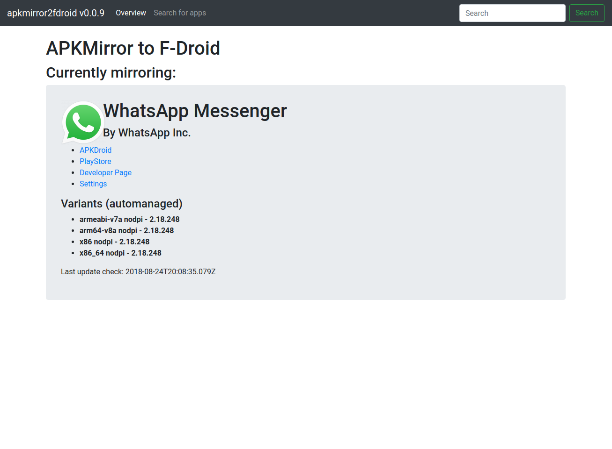
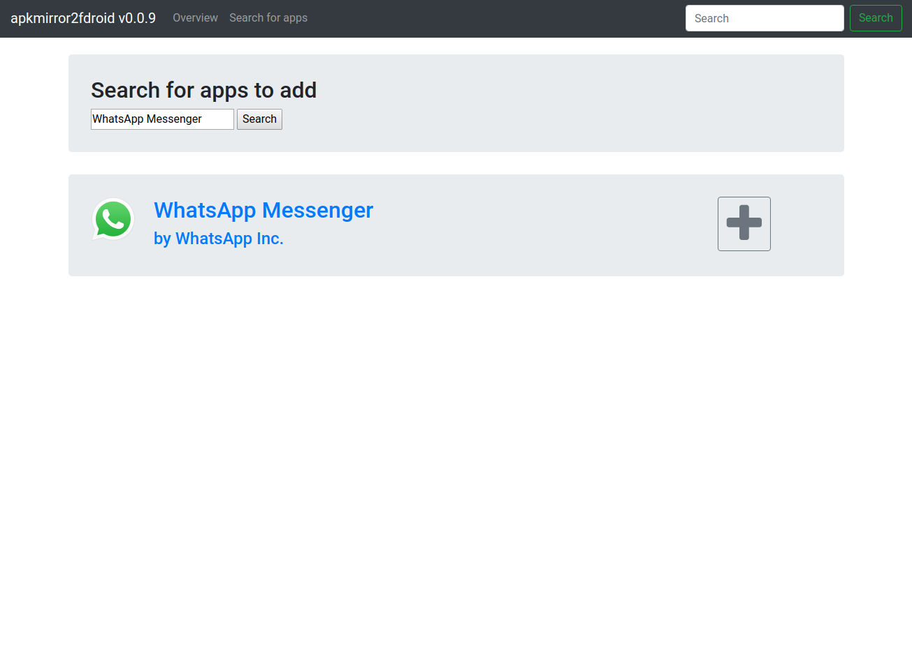
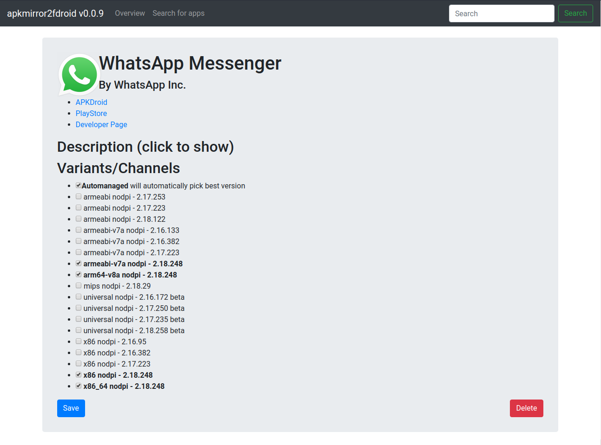

# apkmirror2fdroid

Mirror packages from apkmirror.com to your F-Droid Repo

## Setup

You need:
 - mongodb
 - redis
 - nodeJS
 - fdroidserver

First create the repo by running `mkdir repo && cd repo && fdroid init`

Then install apkmirror2fdroid using `npm i -g apkmirror2fdroid`

Now create a config for the repo: `apkmirror2fdroid genconf > config.json`

Now you need to edit the `repo_url` and `archive_url` in the F-Droid repo `config.py` and the `fdroidRepoPath` in the `config.json`.

You may also want to change the default admin password in `config.json`

After that launch apkmirror2fdroid using `apkmirror2fdroid launch ./config.json`

## Screenshots

## ToDos

 - [x] Adding Apps
 - [x] Repo settings
 - [x] Update checks
 - [x] Download apps
 - [ ] Update repo
 - [x] Write metadata to repo
